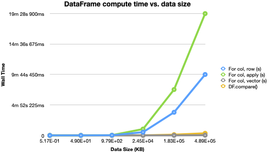
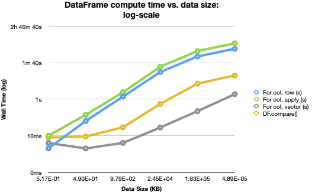

# py-pandas-profile
Comparison of various implementations of a data comparator using pandas Python library

## Introduction
Pandas is a Python library for data analysis and manipulation. As we continue to perform more experiments as data scientists, I think it's important we understand the libraries we use. Pandas offers several methods for data storage and manipulation. As such, there can be muliple methods to achieve the same task. 

### Data Comparator
This experiment uses a simple DataFrame comparator as the basis for benchmarking. There are 4 implementations of the comparator algorithm (in order of measured performance, see [Implementation](#Implementation) for details):
1. Iterate over columns and compare all rows per-column "vector-wise"
2. `DataFrame.compare()`
3. Iterate over columns and rows to compare element-wise
4. Iterate over columns and use `DataFrame.apply()` to compare element-wise

## Conclusion
1. The vector-wise per-column iteration implementation (without using `DataFrame.apply()`) had more than `500x` improvement over the other loop-based methods.

2. `DataFrame.apply()` can be an effective method for manipulating data, however it needs to be used with caution if working with large datasets.

## Results
The following line-charts are generated based on the data recorded in [./data/pandas-compare.csv](./data/pandas-compare.csv). This experiment generated several CSV files containg integers of varying dimensions: 10x10 (0.5 KB) to 1,000,000x100 (0.49 GB). The data was generated on MacOSX (`x86_64: 2.9 GHz; 16 GB`).




### Experiment
[`./cmp_data.py`](./cmp_data.py) was used to run the experiment:
```sh
# GENERATE: 
$ python3 cmp_data.py --generate -s "[(10,10), (1000,10), (10000, 20), (100000, 50), (500000, 75), (1000000, 100)]" 

# ANALYZE:
$ python3 cmp_data.py --analyze -d ./samples
```

### Implementation
The following code snippets are from `cmp_data.py` implementing the 4 methods being evaluated:

1. Iterate over columns and compare all rows per-column "vector-wise"
    ```
    for c in dfa.columns:
        diffs[c] = dfb[c] - dfa[c]
    ```

2. `DataFrame.compare()`
    ```python
    diffs = dfa.compare(dfb)
    ```

3. Iterate over columns and rows to compare element-wise
    ```python
    for c in dfa.columns:
        for i, ri_a in enumerate(dfa[c]):
            diffs[c].append(dfb[c][i] - ri_a)
    ```

4. Iterate over columns and use `DataFrame.apply()` to compare element-wise
    ```python
    for c in cols:
        diffs[c].append(dfM.apply(lambda row: row[c+'_a'] - row[c+'_b'], axis=1))  # element-wise, despite using .apply()
    ```

### Assumptions
The following assumptions were made about the type of data used:
1. All values in the DataFrames are `Numeric` (i.e. `integer`)
2. The compared DataFrames are of the same shape, and have the same column names.
